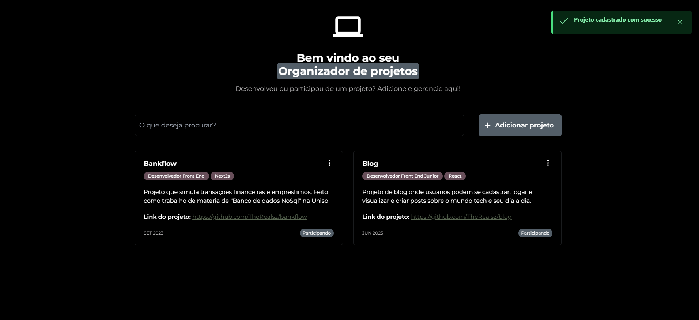
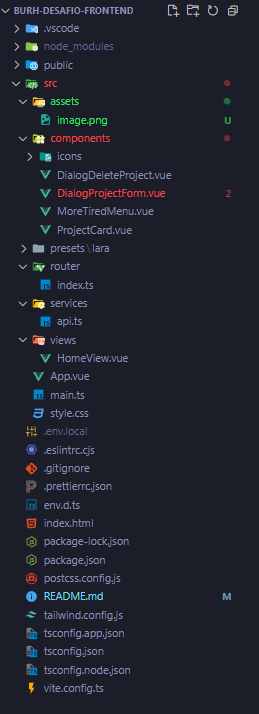
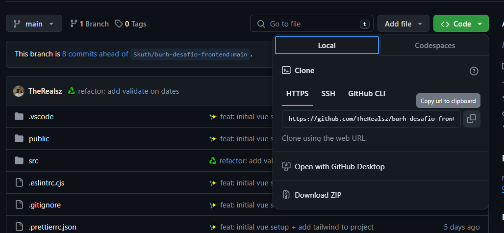

# burh-desafio-frontend




> Projeto que foca em organizador os projetos de um desenvolvedor, tanto profissionais quanto de estudo, assim, sendo possivel utilizar para organização e portfolio.

## Como foi resolver o teste?

Minha experiência resolvendo o teste foi bastante desafiadora. Tenho bastante conhecimento em ReactJs e NextJs 14, e acreditei que com Vue a curva de aprendizado seria tranquila. No entanto, foi mais complicado do que eu esperava. Passei a maior parte do tempo construindo o design responsivo, juntamente com a implementação de uma biblioteca para utilizar o dropdown e o modal.

Encontrei dificuldades ao gerenciar o estado, e precisei recorrer bastante às inteligências artificiais para me ajudar a entender e corrigir meu código. Consegui realizar a criação (create) com validações de campos e tipos específicos, e a leitura (read) exibindo todos os projetos criados, cada um com suas informações dentro de um card. Também consegui implementar a exclusão (delete) de um projeto específico a partir de um modal.

Implementei um design responsivo com o conceito de mobile first, tratei erros e exceções, e adicionei animações CSS em partes específicas do projeto. Unica funcionalidade da qual não consegui realizar foi a de update, onde tive muitos problemas em setar dentro dos inputs os valores que vinham por props.

Sobre a organização do projeto, foquei em tentar manter da forma mais proxima do que trabalho no React, tendo a unica diferença a organizaçao dos componentes. Como é um projeto mais simples e pequeno, joguei os componentes tudo dentro da pasta `components`, em situações de projetos maiores, costumo verificar primeiramente se o componente tem escopo global ou local, caso seja global, crio uma pasta dentro de `components` com o nome do componente e o crio no arquivo principal (caso haja mais componentes dentro dele, crio subpastas para melhor organiza-los), e caso seja local, crio dentro da pasta da `page` uma pasta `components` e nela organizo os componentes locais especificos daquelas pagina. A outra pasta extra que criei foi a de `services` que foi onde criei a instancia do `axios` e fiz as configurações basicas.



## Perfil Burh

Segue o link para meu perfil: [Perfil](https://burh.com.br/RobsonOliveira61)

## 💻 Pré-requisitos

Antes de começar, verifique se você atendeu aos seguintes requisitos:

- Você instalou a versão mais estavel do `NodeJs e GIT`
- Você leu `este Readme`

## 🚀 Instalando burh-desafio-frontend

Para instalar o burh-desafio-frontend, siga estas etapas:

1. Copie essa url ao apertar o botão `code`

   

2. Escolha a pasta que o projeto ficara e em seu terminal, utilize o comando `git clone` seguido da url que voce copiou. Ficara dessa forma:

```
git clone https://github.com/TheRealsz/burh-desafio-frontend.git
```

3. Após isso, digite o seguinte comando para entrar dentro da pasta do projeto

```
cd burh-desafio-frontend
```

4. Para terminar, instale as dependencias utilizando o seguinte comando

```
npm i
```

## ☕ Usando burh-desafio-frontend

Para usar burh-desafio-frontend, siga estas etapas:

1. Após terminar a instalação, dentro da pasta do projeto, crie um arquivo chamado `.env.local`. Dentro deste arquivo, cole este pedaço de código:

```
VITE_API_URL="https://crudcrud.com/api/0db33200b3b4466dab5cb4629be2b045"
```

Obs: Como estamos utilizando uma API publica, é possivel que o token (e.g: `0db33200b3b4466dab5cb4629be2b045`) acabe expirando. Caso queira contornar esse possivel problema, entre em [Crud Crud](https://crudcrud.com/) e copie a URL que aparecera para voce, cole dentro do arquivo `.env.local` e salve o arquivo!

2. Após colar o código acima no arquivo especificado e salvar, com o terminal aberto na pasta do projeto, rode o seguinte comando:

```
npm run dev
```

Após um tempo, será possivel acessar pelo seu navegador a seguinte url, onde estara o projeto funcionando:

```
http://localhost:5173/
```

Agora é só utilizar!

## 📫 Contribuindo para burh-desafio-frontend

Para contribuir com burh-desafio-frontend, siga estas etapas:

1. Bifurque este repositório.
2. Crie um branch: `git checkout -b <nome_branch>`.
3. Faça suas alterações e confirme-as: `git commit -m '<mensagem_commit>'`
4. Envie para o branch original: `git push origin burh-desafio-frontend / <local>`
5. Crie a solicitação de pull.

Como alternativa, consulte a documentação do GitHub em [como criar uma solicitação pull](https://help.github.com/en/github/collaborating-with-issues-and-pull-requests/creating-a-pull-request).
